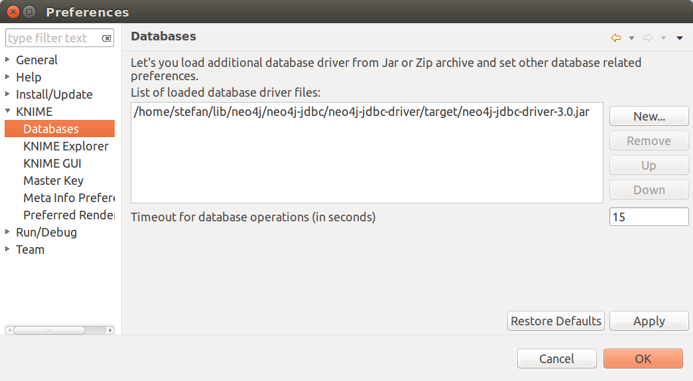
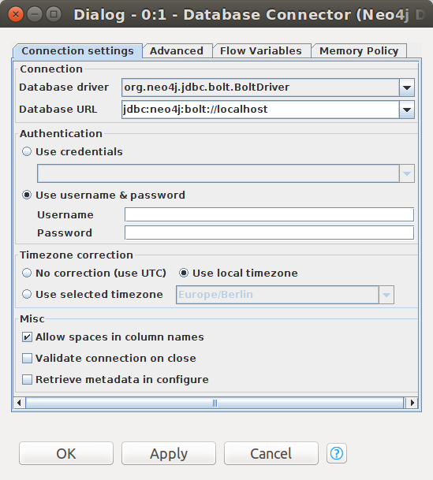
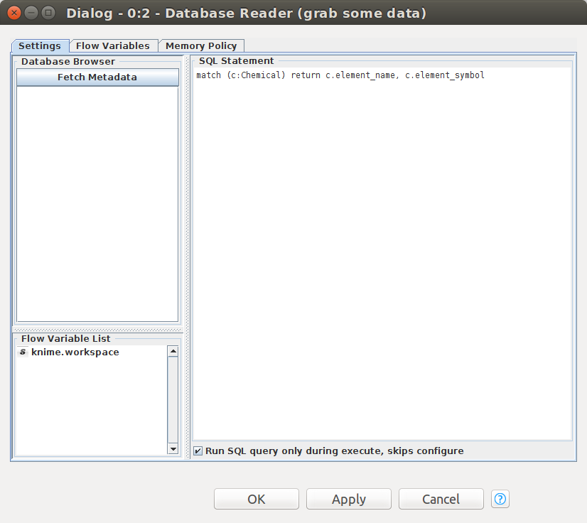
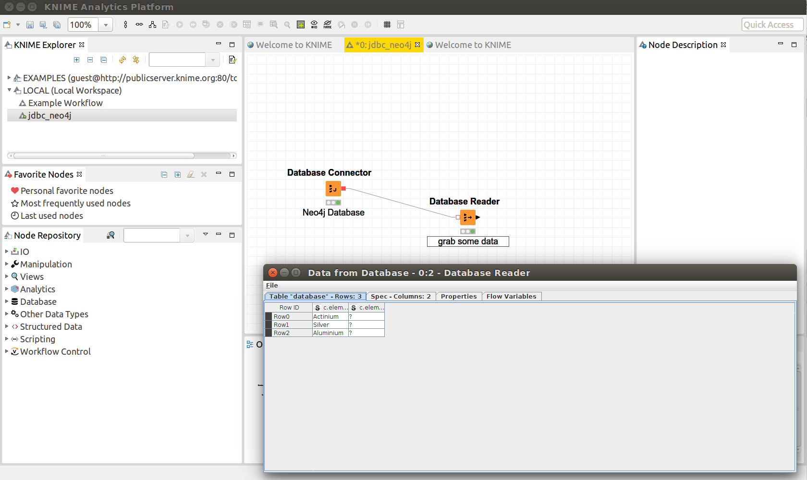

=== Knime

https://www.knime.org/knime-analytics-platform[Knime] is an open source platform for data analytics. To access data from
a Neo4j database first go to `File|Preferences` menu, in the dialog navigate to `KNIME|databases`. Add the Neo4j JDBC
driver jar file as shown here

In your workflow drag&drop a `Database|Connector|Database Connector` into the pane and configure the database connection:

If your database uses authenticate don't forget to provide login and password here.

To include a Cypher query in your workflow, add a `Database|Read/Write|Database Reader` node to your workflow and connect
it to the "Database Connecter" from above. Your Cypher statement goes to the database reader's `SQL Statement` field:

When executing the workflow you'll see data gets fetched from Neo4j

